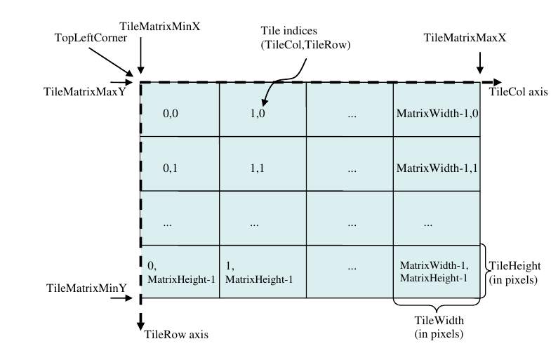
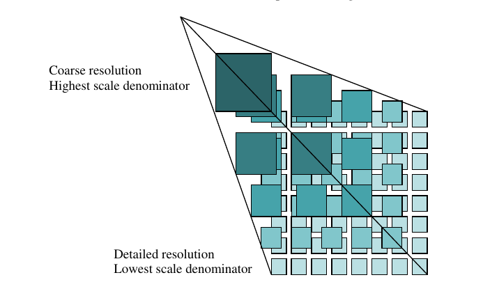

## Termíny a definice

* **Webové mapové služby**

  Webové mapové služby jsou určeny pro sdílení geografických dat v prostředí
  Internetu na principu servisně orientované architektury (architektury
  orientované na služby). Při přístupu k datům skrze webovou mapovou službu
  nepracuje uživatel s vlastními daty, ale pouze s jejich obrazem. Nejčastěji je
  tato mapová služba publikována v souladu se standardem [OGC WMS](https://ogc.org/standards/wms)

* **Dlaždicová mapová služba**
  
  Dlaždicová mapová služba distribuuje před-generované sady obrázků uspořádaných
  do předem známé matice. K jednotlivým obrázků tak mohou mapové aplikace
  přistupovat na základě jejich umístění v matici pomocí souřadnic x, y a z
  (číslo sloupce, číslo řádku, úroveň přiblížení). Data jsou k dispozici za
  řádově menšího nároku na výpočetní server (často předem uložená v paměti
  serveru). Nevýhodou je diskrétní sada předem připravených měřítek a staticky
  vygenerované výstupy (nelze provádět jednoduše aktualizaci).

  Tímto způsobem lze distribuovat jak rastrové dlaždice (ve formátech JPEG, PNG,
  WebP, ...), tak vektorové (nejčastěji formát PBF).

  Nejčastěji se využívá standard [OGC WMTS](https://ogc.org/standards/wmts) nebo
  [TMS](https://wiki.osgeo.org/wiki/Tile_Map_Service_Specification)

* **Dlaždicová matice** - Tile matrix

  Definice pro konkrétní měřítko. Matice je definována:

  1. Měřítkem (při rozlišení pixelu 28×28 mm)
  2. Šířkou a výškou v pixelech
  3. Souřadnice levého-horního rohu
  4. Počet dlaždic ve směru os x a y

  
  Definice matice dlaždic pro konkrétní měřítko podle 
  [OGC WMTS](https://ogc.org/standards/wmts)

* **Sada matic dlaždic** - Tile matrix set

  Sada jednotlivých matic poskytovaná službou pro jednotlivá měřítka. Sada
  matic se sestává z několika dlaždicových matic.

  
  Definice sady matic dlaždic podle
  [OGC WMTS](https://ogc.org/standards/wmts)

* **Úroveň přiblížení** - Zoom level
  
  V praxi se jedná o měřítko mapy, které je dané zejména rozlišením rastrového
  obrázku. Úroveň přiblížení je určena celým číslem - indexem - dané matice v
  sadě matic. Web Mercator měřítková sada je definována od úrovně 0 (celá Země
  je vykreslena v jedné dlaždici) a v praxi se využívá maximálně úroveň 23 (měřítko přibližně 1:70)
 
* **Další termíny**

  ...
